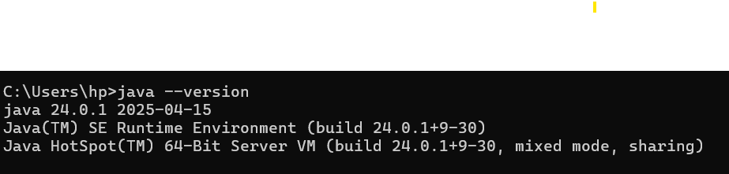
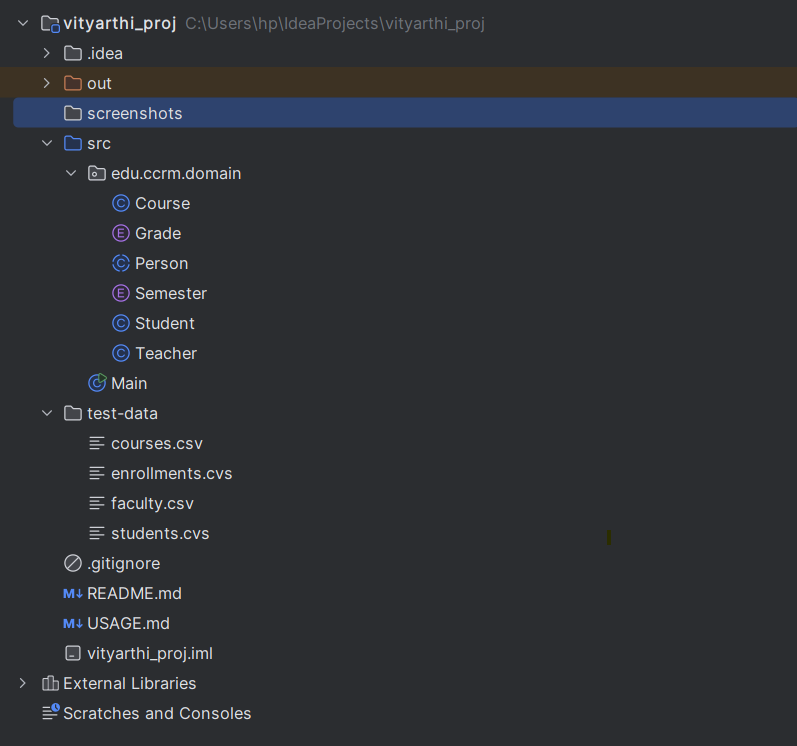
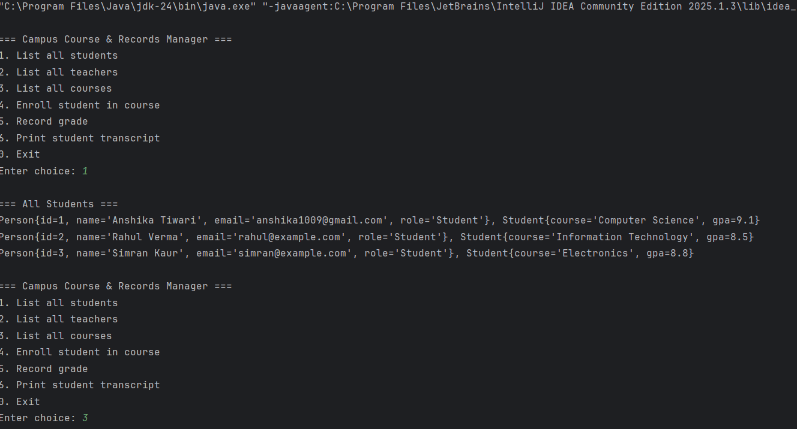
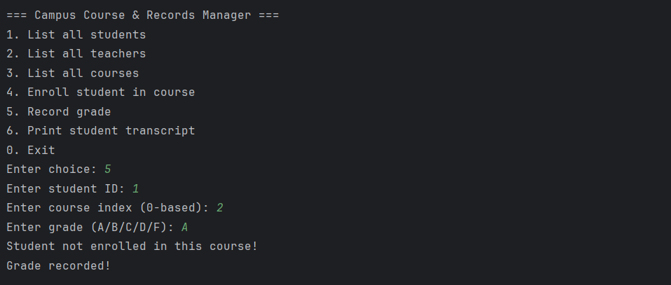

# Vityarthi Project: Campus Course & Records Manager 🎓


A simple, console-based Java application to manage campus courses, students, teachers, and their enrollments.

---

## 📜 Description

**Vityarthi Project** is a straightforward tool for managing academic records. It provides a clean way to view students, courses, and enrollments from a data source. The project is built with Java and can be populated with test data using optional CSV files.

---

## ✨ Features

-   🧑‍🎓 **Manage Records**: Handle students, courses, and teachers.
-   📋 **View Enrollments**: Easily list which students are enrolled in which courses.
-   ✍️ **Data Handling**: Add or update records as needed.
-   💾 **CSV Support**: Uses optional CSV files for easy testing and data population.

---

## 📁 Project Structure

Here's an overview of the project's file organization:

```

vityarthi\_proj/
├── src/                     
│   └── edu/
│       └── ccrm/
│           └── domain/       
│               ├── Person.java
│               ├── Student.java
│               ├── Teacher.java
│               └── Course.java
├── test-data/                
│   ├── students.csv
│   ├── courses.csv
│   └── enrollments.csv
├── README.md                 
└── USAGE.md                 

```

---

## ✅ Prerequisites

Before you begin, ensure you have the following installed:

* **Java JDK**: Version 11 or higher.
* **IDE**: A Java-compatible IDE like [IntelliJ IDEA](https://www.jetbrains.com/idea/) or [Eclipse](https://www.eclipse.org/downloads/).
* **(Optional)** The `test-data` folder with CSV files if you wish to use sample data.

---

## 🚀 How to Run

Follow these steps to get the project running:

1.  **Clone & Open**: Clone the repository and open the project folder in your IDE.
2.  **Locate Test Data**: Ensure the `test-data/` folder is at the root of the project if you're using the CSV files.
3.  **Run Application**: Find the `Main` class and run it.
4.  **Check Output**: The program will print the lists of students, courses, and their enrollments to the console.

---

## 📸 Screenshots

<details>
<summary>Click to view screenshots</summary>

### Java Version


### IDE Setup


### Program Output



</details>

---

## 👨‍💻 Author

 **Himanshu Yadav**
